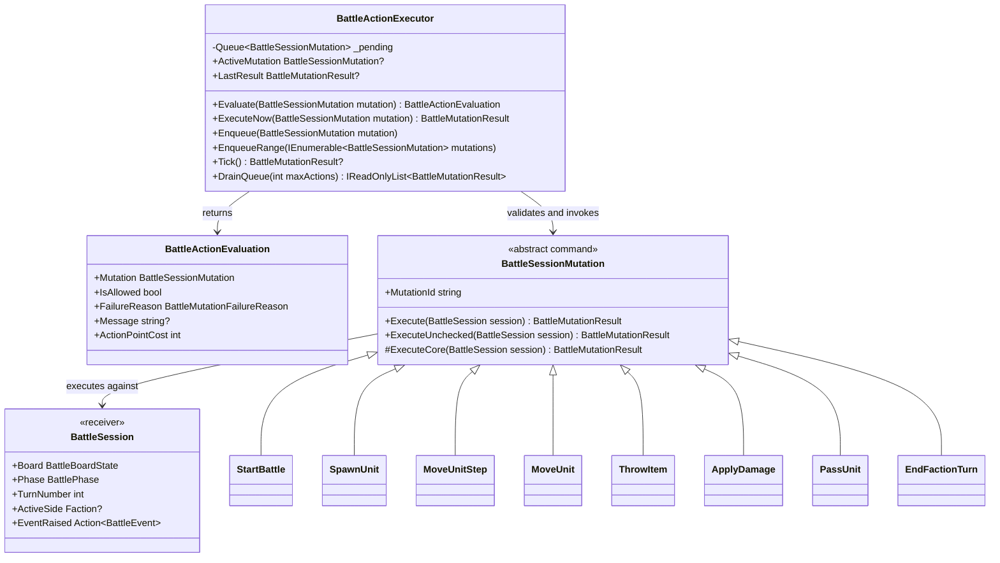

# BattleSession Command Pattern

This document describes the command-pattern shape currently used around `BattleSession`, `BattleSessionMutation`, and `BattleActionExecutor`.

## Pattern Mapping

- `BattleSessionMutation` = command
- `BattleActionExecutor` = validator and invoker
- `BattleSession` = receiver and aggregate root

## Current Flow

```text
BattleSceneController / HUD / AI
  -> build BattleSessionMutation
  -> optional BattleActionExecutor.Evaluate(mutation)
  -> BattleActionExecutor.Enqueue(mutation) or ExecuteNow(mutation)
  -> mutation.ExecuteUnchecked(session)
  -> BattleSession bookkeeping APIs
  -> BattleEvent emission
```

The queue and replay surface stay focused on authoritative battle commands.

## Class Layout



## BattleSessionMutation

`BattleSessionMutation` is the command type used by the runtime.

The base class exposes:

```csharp
public abstract class BattleSessionMutation
{
  public string MutationId { get; }

  public BattleMutationResult Execute(BattleSession session)
  {
    ArgumentNullException.ThrowIfNull(session);
    return new BattleActionExecutor(session).ExecuteNow(this);
  }

  internal BattleMutationResult ExecuteUnchecked(BattleSession session)
  {
    ArgumentNullException.ThrowIfNull(session);
    var result = ExecuteCore(session);
    if (result.Succeeded)
      session.RefreshVisibility();

    return result;
  }

  protected abstract BattleMutationResult ExecuteCore(BattleSession session);
}
```

The important split is:

- the executor decides whether a supported mutation is legal right now
- the mutation applies the state change once execution begins
- the session keeps authoritative bookkeeping consistent

## BattleActionExecutor

`BattleActionExecutor` is now a real validator and command invoker.

It currently owns:

- mutation preview via `Evaluate(...)`
- pending mutation queue state
- execution ordering
- exception isolation around mutation execution
- last-result tracking

It does not own:

- selection logic
- tactical truth
- presentation state

## BattleSession Responsibilities

`BattleSession` remains the aggregate root and source of truth.

It owns:

- authoritative battle state
- alive and dead unit registration
- active faction and turn number
- faction order and round queue state
- availability for the current faction turn
- visibility refresh and bookkeeping
- event emission

It should not own a command-type dispatch switch. Commands and the executor sit around the session; they do not replace it as the authority.

## Query And Commit Split

The current runtime works best when responsibilities stay narrow:

- scene controllers and AI query board, visibility, and unit state
- preview code calls `BattleActionExecutor.Evaluate(...)`
- executor validates whether the mutation may run
- mutation code commits the change through session and board helpers
- `BattleSession` emits authoritative events

That split keeps controller code from duplicating legality rules while also keeping mutation application logic out of presentation code.

## Design Rules

- `BattleSession` stays the only owner of tactical truth.
- `BattleActionExecutor` owns legality checks for supported player-facing mutations.
- `BattleSessionMutation` owns command-specific application logic.
- command classes should not read or write session backing collections directly.
- event emission should remain authoritative and happen through `BattleSession`.
- null-returning and failure-prone helpers should always be checked before continuing.

## Near-Term Extension Points

The next clean expansions on top of this pattern are:

- more explicit read-only preview queries beside `Evaluate(...)`
- richer multi-step execution contexts for interrupts or reaction fire
- splitting large mutation files into one file per concrete command when the command set grows
