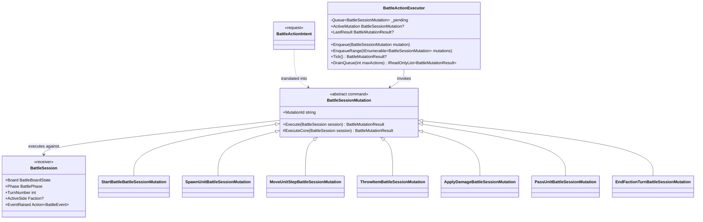

# BattleSession Command Pattern

This document sketches the target class layout for a full Command-pattern refactor around `BattleSession`, `BattleSessionMutation`, and `BattleActionExecutor`.

It is a forward-looking design note, not a description of the current implementation.

## Design Goals

- Make `BattleSessionMutation` a real command object instead of a data-only mutation message.
- Let `BattleActionExecutor` invoke commands directly instead of translating action requests through a large switch.
- Keep `BattleSession` as the single source of truth for live battle state.
- Shrink `BattleSession` so it focuses on authoritative bookkeeping, turn flow, queue reconciliation, and event emission.
- Keep battle invariants protected by `BattleSession` instead of letting commands mutate arbitrary collections directly.

## Pattern Mapping

- `BattleSessionMutation` = command
- `BattleActionExecutor` = invoker
- `BattleSession` = receiver and aggregate root
- `BattleActionIntent` = higher-level request model outside the command layer

`BattleActionIntent` still has value as a UI or AI-facing request shape, but it should sit upstream from the command queue.

## Target Flow

```text
BattleSceneController / BattleAIController
  -> BattleActionIntent
  -> translate to BattleSessionMutation
  -> BattleActionExecutor.Enqueue(mutation)
  -> BattleActionExecutor.Tick()
  -> mutation.Execute(session)
  -> BattleSession bookkeeping APIs
  -> BattleEvent emission
```

The important change is that the executor queues and invokes commands directly. Intent translation happens before the command enters the queue.

## Class Layout



## Proposed Public Surface

### BattleSessionMutation

Keep the current concrete mutation subclasses, but give the base type execution behavior.

```csharp
public abstract class BattleSessionMutation
{
  public string MutationId { get; }

  public BattleMutationResult Execute(BattleSession session)
  {
    ArgumentNullException.ThrowIfNull(session);
    return ExecuteCore(session);
  }

  protected abstract BattleMutationResult ExecuteCore(BattleSession session);
}
```

Each concrete mutation owns:

- its own validation
- its own battle-state orchestration
- its own success or failure result
- its own choice of affected unit and message

### BattleSession

`BattleSession` should not expose a public `Apply(...)` wrapper in the strict Command-pattern version.

Commands execute directly:

```csharp
var result = mutation.Execute(session);
```

`BattleSession` should stop owning command-specific branching logic. Its job is to expose narrow authoritative APIs that commands use to keep session state consistent.

### BattleActionExecutor

The executor should become a real command invoker:

```csharp
public sealed class BattleActionExecutor
{
  public void Enqueue(BattleSessionMutation mutation);
  public void EnqueueRange(IEnumerable<BattleSessionMutation> mutations);
  public BattleMutationResult? Tick();
  public IReadOnlyList<BattleMutationResult> DrainQueue(int maxActions = int.MaxValue);
  public BattleSessionMutation? ActiveMutation { get; }
  public BattleMutationResult? LastResult { get; }
}
```

If the project still wants to keep `BattleActionIntent`, the translation from intent to command should happen before enqueue or in a thin adapter method, not inside the executor's main execution loop.

## BattleSession Responsibilities

In this refactor, `BattleSession` should keep only aggregate-root responsibilities.

It should continue to own:

- authoritative battle state
- alive and dead unit registration
- active faction and turn number
- faction order and round queue state
- availability for the current faction turn
- event emission
- book-keeping around faction elimination, turn advancement, and battle end conditions

It should stop owning:

- the big mutation-type switch
- per-command handler methods such as `Handle(MoveUnitStepBattleSessionMutation ...)`
- logic that exists only to dispatch a command to its implementation

## Recommended Internal API Shape

Commands should not manipulate `_aliveUnitsByFaction`, `_turnQueue`, `_deadUnits`, or `_factionUnitsStillAvailableThisTurn` directly.

Instead, `BattleSession` should expose a narrow internal API grouped around bookkeeping primitives.

### Query Helpers

- `internal BattleUnitState? GetLivingUnitOrNull(int unitId)`
- `internal BattleUnitState? GetUnitOrNull(int unitId)`
- `internal IEnumerable<BattleUnitState> GetFactionAlive(Faction side)`
- `internal bool HasLivingUnits(Faction side)`
- `internal bool CanUnitActNow(BattleUnitState unit)`
- `internal bool IsUnitStillAvailableThisTurn(int unitId)`

### Board And Unit Commit Helpers

- `internal bool TryAddLivingUnit(BattleUnitState unit)`
- `internal bool TryMoveUnit(BattleUnitState unit, Vector3I destination)`
- `internal void MoveUnitToDeadStorage(BattleUnitState unit)`
- `internal void ClearTileOccupant(Vector3I coordinates)`

### Turn And Queue Helpers

- `internal void RefreshCurrentFactionAvailability()`
- `internal void RegisterSpawnedUnitForCurrentRound(BattleUnitState unit)`
- `internal void AdvanceTurn()`
- `internal void StartNextRound()`
- `internal void BeginNextQueuedSideTurn()`
- `internal void HandleFactionLoss(Faction side)`
- `internal void EndBattle()`

### Event Helpers

- `internal void RaiseEvent(BattleEvent battleEvent)`

The rule is:

- commands decide what should happen
- `BattleSession` commits authoritative bookkeeping

## Command Responsibilities By Example

### MoveUnitStepBattleSessionMutation

This command should own:

- validating that the battle is in progress
- resolving the acting unit
- checking active side rules
- checking adjacency and AP cost
- calling session helpers to commit movement
- raising the `UnitMoved` event through the session

It should not directly edit queue state because movement does not own turn progression rules.

### ApplyDamageBattleSessionMutation

This command should own:

- resolving the target unit
- applying damage to the unit
- raising `UnitDamaged`
- deciding whether death follow-up is needed

It should delegate bookkeeping to session helpers for:

- moving the unit to dead storage
- clearing tile occupancy
- removing the unit from current-turn availability
- handling faction loss
- preserving authoritative death bookkeeping without taking on presentation-layer selection concerns

### PassUnitBattleSessionMutation

This command should own:

- validating the current active side
- resolving the unit
- marking the unit's activation complete
- deciding whether to select another ally or end the faction turn

It should call session helpers for:

- removing current-turn availability
- turn advancement
- event emission

## Boundary With BattleActionIntent

`BattleActionIntent` remains useful, but it is not the command once this refactor is complete.

Recommended split:

- `BattleActionIntent` = external request from controller, HUD, or AI
- `BattleSessionMutation` = executable command in the authoritative battle runtime

That keeps the queue and replay layer focused on battle commands instead of UI-facing intent objects.

## Suggested File Ownership

Keep the current file split, but change the responsibility of each file.

- `scripts/battle/BattleSession.cs`
  - aggregate state
  - authoritative bookkeeping helpers
- `scripts/battle/BattleSessionMutation.cs`
  - command base class
  - concrete command subclasses
  - command execution logic
- `scripts/battle/BattleActionExecutor.cs`
  - mutation queue
  - mutation invocation
  - execution results and executor events

If `BattleSessionMutation.cs` grows too large, the next clean step is one file per concrete command class. The command pattern still holds either way.

## Design Rules

- `BattleSession` stays the only owner of tactical truth.
- Presentation-layer selection state belongs outside `BattleSession`.
- Commands may orchestrate state changes, but they should commit session-wide bookkeeping through narrow session APIs.
- Command classes should not read or write session backing collections directly.
- The executor should queue executable commands, not unprocessed requests.
- Event emission should remain authoritative and happen through `BattleSession`.
- Null-returning and failure-prone session helpers should always be checked by commands before continuing.

## Migration Plan

1. Add `Execute(BattleSession session)` to `BattleSessionMutation`.
2. Move one command, such as `MoveUnitStepBattleSessionMutation`, out of `BattleSession` and into its mutation class.
3. Remove `BattleSession.Apply(...)`.
4. Convert `BattleActionExecutor` to queue `BattleSessionMutation` instead of `BattleActionIntent`.
5. Leave `BattleActionIntent` as an upstream request model and translate it before enqueue.
6. Move the remaining mutation handlers one at a time.

This migration keeps the refactor incremental while still converging on the full Command-pattern shape.
