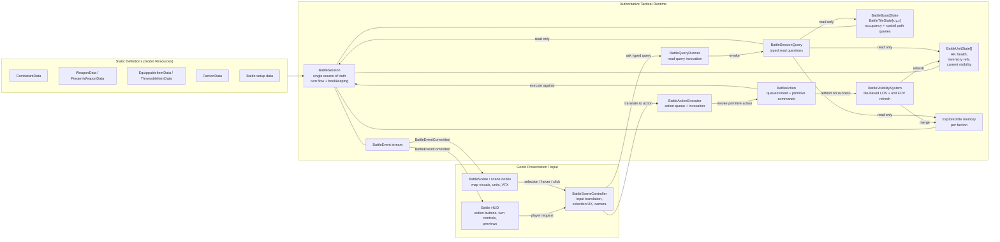
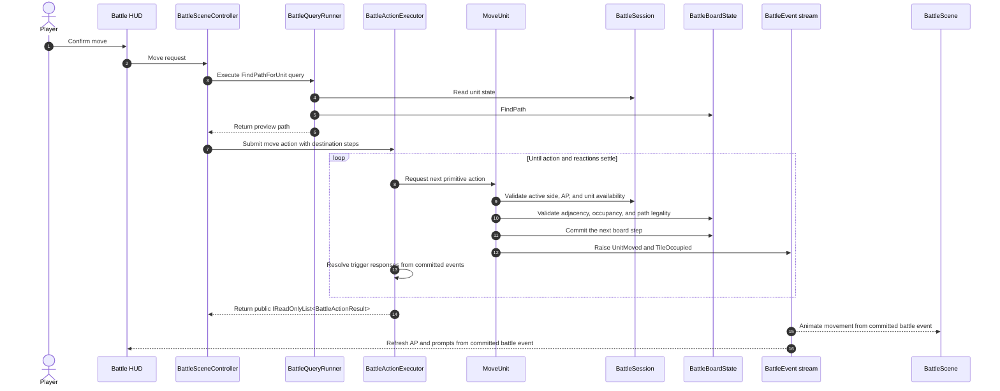

# Battlescape Tactical Runtime Architecture

This document describes the tactical runtime shape in the repo and the nearby extensions it is designed to support. It reflects the current command-based session design and typed read-side query interface.

## Design Goals

- `BattleSession` is the single source of truth for live tactical state.
- `BattleSession` is constructed from battle setup data: a prepared board state, stable faction order, and faction rosters.
- `BattleAction` is the authoritative command layer.
- `BattleActionExecutor` validates primitive actions produced by queued `BattleAction` values.
- Read-side battle questions are represented as typed query objects, executed through a single query runner.
- Controllers, HUD code, and AI should ask battle-state questions through explicit query types instead of accumulating public query methods on `BattleSession`.
- Godot scene nodes own presentation, input, and focused-unit UX. They do not own tactical truth.
- Board coordinates use normal `Godot.Vector3I` semantics:
  - `X` = width
  - `Y` = levels / height
  - `Z` = length / depth
- Future tactical systems such as pathfinding, effects, and AI should integrate through explicit session reads and action execution instead of mutating scene state directly.

## Current Runtime Diagram



## Ownership Rules

- `BattleSession` owns:
  - battle phase
  - turn number
  - active side
  - global faction order
  - pooled unit identity
  - unit position lookup
  - round queue
  - alive and dead unit bookkeeping
  - current-turn unit availability
  - faction explored-tile memory
  - authoritative battle event emission
- `BattleBoardState` owns:
  - tile storage
  - walkability and occupancy state
  - adjacency queries
  - occupant placement, movement, and removal
  - board-local pathfinding queries
- `BattleAction` owns action-specific application and any composite action sequencing after executor-side validation succeeds.
- `BattleVisibilitySystem` owns:
  - tile-based line-of-sight checks
  - tile visibility checks
  - deriving visible units from visible tiles
  - refreshing current unit visibility from session state
- `BattleActionExecutor` owns:
  - preview validation for supported primitive actions
  - the pending action queue
  - invocation order
  - trigger response scheduling after committed events
  - last-result tracking
  - exception isolation around command execution
- `BattleQueryRunner` owns:
  - the single public entry point for read-side tactical questions
  - null checks on submitted query objects
  - invoking typed query objects against the current session
- concrete `BattleSessionQuery<TResult>` classes own:
  - one specific read-side question
  - the result type and failure semantics for that question
  - any query-specific composition across session, board, visibility, or unit state
- `BattleSceneController`, `BattleScene`, and HUD own:
  - focused / selected unit UX
  - previews
  - camera behavior
  - presentation timing
- `BattleSession` does not track a selected unit. Selection is presentation state.
- `BattleSession` should not grow a public method for every controller, HUD, or AI question.
- Inventory currently lives on `BattleUnitState`. There is no separate `BattleItemState` runtime layer yet.

## Runtime Components

### BattleSession

`BattleSession` currently exposes authoritative state and bookkeeping around:

- `Board`
- `Phase`
- `TurnNumber`
- `ActiveSide`
- `AliveUnits`
- `DeadUnits`
- `GlobalFactionTurnOrder`
- `TurnQueue`
- `FactionRosters`

It is initialized with:

- `BattleBoardState board`
- `IEnumerable<Faction> globalFactionOrder`
- `IDictionary<Faction, IEnumerable<Combatant>> factionRosters`

The configured faction order must contain at least one faction after rosters are included. The setup turn queue and `ActiveSide` are initialized from the first faction in that order.

The session owns:

- creating runtime unit ids
- moving units between alive and dead storage
- handling faction elimination
- rebuilding and advancing the round queue
- refreshing action-point availability for the active side
- rebuilding faction visibility after successful actions
- ending the battle when no living factions remain

The target public read-side surface is a query runner, not a growing method list:

```csharp
var result = session.Queries.Execute(new SomeBattleQuery(...));
```

The session may keep internal helpers for actions and query objects, but controllers and AI should not depend on those helpers directly.

### BattleSessionQuery

Read-side tactical questions should be modeled as typed query objects.

Current base shape:

```csharp
public abstract class BattleSessionQuery<TResult>
{
  public string QueryId { get; }

  protected BattleSessionQuery(string queryId)
  {
    if (string.IsNullOrWhiteSpace(queryId))
      throw new ArgumentException("Query id cannot be null or whitespace.", nameof(queryId));

    QueryId = queryId;
  }

  internal abstract BattleQueryResult<TResult> Execute(BattleSession session);
}
```

Current runner shape:

```csharp
public sealed class BattleQueryRunner
{
  private readonly BattleSession _session;

  internal BattleQueryRunner(BattleSession session)
  {
    _session = session ?? throw new ArgumentNullException(nameof(session));
  }

  public BattleQueryResult<TResult> Execute<TResult>(BattleSessionQuery<TResult> query)
  {
    ArgumentNullException.ThrowIfNull(query);
    return query.Execute(_session);
  }
}
```

`BattleQueryResult<TResult>` has explicit success and failure shapes. Query callers should handle `BattleQueryFailureResult<TResult>` before using a `BattleQuerySuccess<TResult>.Value`; missing units, invalid tiles, and invalid battle-state questions are failures, not nullable query values.

Example query types:

- `FindPathForUnit`
- `GetPossibleMoveTilesForUnit`
- `GetVisibleEnemiesForUnit`
- `GetVisibleUnitsForFaction`
- `CanUnitActNow`
- `IsTileVisibleToFaction`
- `GetFactionAliveUnits`

Each query should encode one question. Avoid catch-all query classes with enum modes, nullable selector fields, or behavior controlled by unrelated properties. If a query algorithm becomes complex or variable, use a strategy behind that specific query rather than turning the query runner into a dispatch switch.

### BattleBoardState

`BattleBoardState` now owns board-local spatial operations:

- `TryPlaceOccupant(...)`
- `TryMoveOccupant(...)`
- `TryClearOccupant(...)`
- `FindPath(...)`
- `IsAdjacent(...)`

Pathfinding is currently integrated directly into the board through Godot `AStar3D`. Query objects should be the controller-facing surface for unit-specific path questions, for example `FindPathForUnit` and `GetPossibleMoveTilesForUnit`. If path rules become substantially more unit-specific later, this can be extracted behind a movement-query strategy without changing the controller-facing query contract.

### BattleVisibilitySystem

`BattleVisibilitySystem` is now a first-class runtime subsystem.

Current behavior:

- uses `VisionStat` as the maximum sight range per unit
- traces LOS from tile center to tile center
- treats units as visible when they stand on a currently visible tile
- stores each unit's current visible `BattleBoardState.ValidatedPoint`s and visible `BattleUnitState` handles on `BattleUnitState`
- stores explored `BattleBoardState.ValidatedPoint` memory per faction on `BattleSession`
- keeps own living units known to their faction even without direct LOS
- refreshes current unit visibility after committed battle events

Current limitations:

- vision is omnidirectional
- `BlocksLineOfSight` is whole-tile occlusion
- there is no smoke attenuation, lighting model, or last-known enemy memory yet

### BattleAction

The current built-in authoritative actions are:

- `StartBattle`
- `SpawnUnit`
- `MoveUnit`
- `ThrowItem`
- `ApplyDamage`
- `PassUnit`
- `EndFactionTurn`

Actions should execute through an explicit executor:

```csharp
var executor = new BattleActionExecutor(session);
var result = executor.Submit(BattleAction.MoveUnit(unit, [destination]));
```

Submitted action results are returned as `IReadOnlyList<BattleActionResult>`. The list reports public action outcomes, not every primitive child commit from a composite action. Each produced result includes:

- success or failure
- failure reason
- optional affected unit
- optional message

### BattleActionExecutor

`BattleActionExecutor` accepts submitted `BattleAction` values. Composite actions yield one primitive `BattleAction` at a time, and the executor invokes primitive actions until the submitted action and its reaction actions settle. Each primitive action validates itself against the current `BattleSession` before committing changes.

Current responsibilities:

- `Submit(...)`
- `OnActionStart` event
- `OnActionComplete` event
- `LastResult`

The executor does not currently:

- own selection logic
- mutate session state directly outside action execution

## Representative Flow: Current Move Command



## Turn Flow Notes

- The battle starts from `BattlePhase.Setup` and transitions to `InProgress` through `StartBattle`.
- Setup initializes the turn queue from the stable global faction order.
- `StartBattle` rebuilds the active round queue from living factions in that order.
- `ActiveSide` and `TurnNumber` are owned by the session.
- `EndFactionTurn` is the explicit faction-turn action.
- `PassUnit` ends a unit activation and currently advances the turn automatically if that side has no remaining actable units.
- Unit death updates alive/dead storage, board occupancy, current-turn availability, and faction queue membership through session bookkeeping.

## Current Battle Events

The current event stream is intentionally small and authoritative. Presentation code observes it through `BattleSession.BattleEventCommitted`, which is raised only after the corresponding state change has happened.

- `SessionStarted`
- `SessionEnded`
- `TurnStarted`
- `TurnEnded`
- `ActiveSideChanged`
- `UnitAdded`
- `UnitActivationEnded`
- `UnitMoved`
- `TileOccupied`
- `UnitDamaged`
- `UnitKilled`
- `ItemThrown`

Presentation code should react to these events instead of inferring state changes from executor internals.

`BattleEventType` is the stable event bucket used by trigger registration. Concrete event subclasses, such as `UnitMovedBattleEvent` and `TurnStartedBattleEvent`, carry event-specific payloads.

## Future Extensions

These systems are still part of the intended architecture, but they are not implemented as first-class runtime systems yet:

- `BattleRules`
- `BattleEffectSystem`
- `BattleAIController`
- movement-query strategies
- targeting-query strategies

When they are added, they should follow these rules:

- read battle state through typed query objects instead of duplicating tactical truth
- commit tactical changes through explicit actions and `BattleActionExecutor`
- emit structured battle events instead of mutating scene nodes directly
- keep presentation-only concerns out of the authoritative runtime

Reaction fire and richer combat-effect hooks are still future extensions on top of the current action-based runtime.

## Canonical Vocabulary

Use these names consistently in future tactical work:

- `BattleSession`
- `BattleAction`
- `BattleActionResult`
- `BattleActionExecutor`
- `BattleTrigger`
- `BattleSessionQuery<TResult>`
- `BattleQueryRunner`
- `BattleQueryResult<TResult>`
- `BattleQueryFailure`
- `BattleBoardState`
- `BattleTileState`
- `BattleUnitState`
- `BattleEvent`
- `BattleSceneController`

Detailed design notes:

- [BattleActionExecutor Design](./battle-action-executor.md)
- [BattleSession Command Pattern](./battle-session-command-pattern.md)
- [Battle Query Interface Implementation Plan](./battle-query-interface-implementation-plan.md)
- [Battlescape Tile System Design](./battlescape-tile-system.md)
