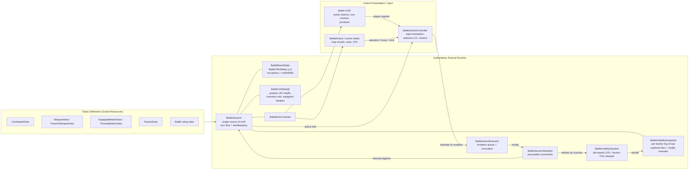
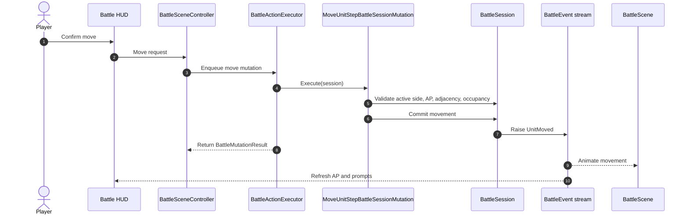

# Battlescape Tactical Runtime Architecture

This document describes the current tactical runtime shape in the repo and the nearby extensions it is designed to support. It reflects the battle code as it exists now, not the older pre-command session design.

## Design Goals

- `BattleSession` is the single source of truth for live tactical state.
- `BattleSession` is constructed from battle setup data: board dimensions, stable faction order, and faction rosters.
- `BattleSessionMutation` is the authoritative command layer. Mutations execute directly against the session.
- `BattleActionExecutor` is a mutation queue and invoker, not an intent-to-action switchboard.
- Godot scene nodes own presentation, input, and focused-unit UX. They do not own tactical truth.
- Board coordinates use normal `Godot.Vector3I` semantics:
  - `X` = width
  - `Y` = levels / height
  - `Z` = length / depth
- Future tactical systems such as pathfinding, effects, and AI should integrate through explicit session reads and mutation execution instead of mutating scene state directly.

## Current Runtime Diagram



## Ownership Rules

- `BattleSession` owns:
  - battle phase
  - turn number
  - active side
  - global faction order
  - round queue
  - alive and dead unit bookkeeping
  - current-turn unit availability
  - board occupancy
  - faction visibility and explored-tile state
  - authoritative battle event emission
- `BattleSessionMutation` owns mutation-specific validation and orchestration. Each concrete mutation decides whether it can execute and which session helpers it needs to call.
- `BattleVisibilitySystem` owns:
  - tile-based line-of-sight checks
  - tile visibility checks
  - deriving visible units from visible tiles
  - rebuilding faction fog-of-war snapshots from session state
- `BattleActionExecutor` owns:
  - the pending mutation queue
  - invocation order
  - last-result tracking
  - exception isolation around command execution
- `BattleSceneController`, `BattleScene`, and HUD own:
  - focused / selected unit UX
  - previews
  - camera behavior
  - presentation timing
- `BattleSession` does not track a selected unit. Selection is presentation state.
- Inventory currently lives on `BattleUnitState`. There is no separate `BattleItemState` runtime layer yet.
- `BattleActionIntent` is still a useful upstream request model, but it is no longer the executor's core input type.

## Current Implemented Runtime

### BattleSession

`BattleSession` currently exposes authoritative state and bookkeeping around:

- `Board`
- `Phase`
- `TurnNumber`
- `ActiveSide`
- `AliveUnits`
- `DeadUnits`
- `GlobalFactionTurnOrder`
- `TurnQueue`
- `FactionRosters`

It is initialized with:

- `Vector3I dimensions`
- `IEnumerable<Faction> globalFactionOrder`
- `IDictionary<Faction, IEnumerable<Combatant>> factionRosters`

The session currently owns:

- creating runtime unit ids
- placing spawned units onto the board
- moving units between alive and dead storage
- handling faction elimination
- rebuilding and advancing the round queue
- refreshing action-point availability for the active side
- rebuilding faction visibility after successful mutations
- ending the battle when no living factions remain
- exposing visibility queries such as:
  - `IsUnitVisibleToUnit(...)`
  - `IsUnitVisibleToFaction(...)`
  - `IsTileVisibleToFaction(...)`
  - `HasFactionExploredTile(...)`
  - `GetVisibleUnitsForFaction(...)`

### BattleVisibilitySystem

`BattleVisibilitySystem` is now a first-class runtime subsystem.

Current behavior:

- uses `VisionStat` as the maximum sight range per unit
- traces LOS from tile center to tile center
- treats units as visible when they stand on a currently visible tile
- builds per-faction current visibility and explored-tile memory
- keeps own living units known to their faction even without direct LOS
- rebuilds the full visibility snapshot after every successful battle mutation

Current limitations:

- vision is omnidirectional
- `BlocksLineOfSight` is whole-tile occlusion
- there is no smoke attenuation, lighting model, or last-known enemy memory yet

### BattleSessionMutation

The current built-in authoritative mutations are:

- `StartBattleBattleSessionMutation`
- `SpawnUnitBattleSessionMutation`
- `MoveUnitStepBattleSessionMutation`
- `ThrowItemBattleSessionMutation`
- `ApplyDamageBattleSessionMutation`
- `PassUnitBattleSessionMutation`
- `EndFactionTurnBattleSessionMutation`

Each mutation executes directly through:

```csharp
var result = mutation.Execute(session);
```

Mutation results are returned as `BattleMutationResult`, including:

- success or failure
- failure reason
- optional affected unit
- optional message

### BattleActionExecutor

`BattleActionExecutor` currently queues `BattleSessionMutation`, not `BattleActionIntent`.

Current responsibilities:

- `Enqueue(...)`
- `EnqueueRange(...)`
- `Tick()`
- `DrainQueue(...)`
- `MutationStarted` event
- `MutationResolved` event
- `LastResult`
- `ActiveMutation`

The executor does not currently:

- resolve intents through a switch
- own selection logic
- mutate session state directly outside mutation execution

## Representative Flow: Current Move Command



## Turn Flow Notes

- The battle starts from `BattlePhase.Setup` and transitions to `InProgress` through `StartBattle`.
- The initial turn queue is built from living factions in the stable global faction order.
- `ActiveSide` and `TurnNumber` are owned by the session.
- `EndFactionTurn` is the explicit faction-turn mutation.
- `PassUnit` ends a unit activation and currently advances the turn automatically if that side has no remaining actable units.
- Unit death updates alive/dead storage, board occupancy, current-turn availability, and faction queue membership through session bookkeeping.

## Current Battle Events

The current event stream is intentionally small and authoritative:

- `SessionStarted`
- `SessionEnded`
- `TurnStarted`
- `TurnEnded`
- `ActiveSideChanged`
- `UnitAdded`
- `UnitActivationEnded`
- `UnitMoved`
- `UnitDamaged`
- `UnitKilled`
- `ItemThrown`

Presentation code should react to these events instead of inferring state changes from executor internals.

## Future Extensions

These systems are still part of the intended architecture, but they are not implemented as first-class runtime systems yet:

- `BattlePathfinder`
- `BattleRules`
- `BattleEffectSystem`
- `BattleAIController`

When they are added, they should follow these rules:

- read session state directly instead of duplicating tactical truth
- commit tactical changes through explicit session helpers and mutation execution
- emit structured battle events instead of mutating scene nodes directly
- keep presentation-only concerns out of the authoritative runtime

Step-based movement, interrupts, reaction fire, and richer combat-effect hooks are still future extensions on top of the current command-based runtime.

## Canonical Vocabulary

Use these names consistently in future tactical work:

- `BattleSession`
- `BattleSessionMutation`
- `BattleMutationResult`
- `BattleActionExecutor`
- `BattleActionIntent` as an upstream request model, not the executor's authoritative queue input
- `BattleBoardState`
- `BattleTileState`
- `BattleUnitState`
- `BattleEvent`
- `BattleSceneController`

Detailed design notes:

- [BattleActionExecutor Design](./battle-action-executor.md)
- [BattleSession Command Pattern](./battle-session-command-pattern.md)
- [Battlescape Tile System Design](./battlescape-tile-system.md)
