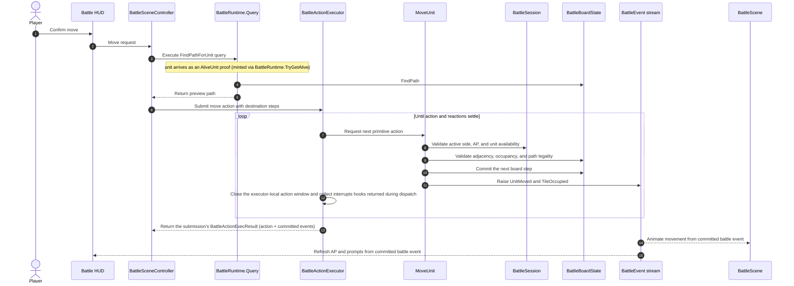

# Battlescape Tactical Runtime Architecture

This document describes the tactical runtime shape in the repo and the nearby extensions it is designed to support. It reflects the current command-based session design and typed read-side query interface.

## Design Goals

- `BattleSession` is the single source of truth for live tactical state.
- `BattleSession` is constructed from battle setup data: a prepared board state and stable faction order.
- `BattleAction` is the authoritative command layer.
- `BattleActionExecutor` validates primitive actions produced by queued `BattleAction` values.
- Read-side battle questions are represented as typed query objects, executed through `BattleRuntime.Query`.
- Controllers, HUD code, and AI should ask battle-state questions through explicit query types instead of accumulating public query methods on `BattleSession`.
- Godot scene nodes own presentation, input, and focused-unit UX. They do not own tactical truth.
- Board coordinates are the engine-agnostic `FunProject.Core.Vector3I` (axis-compatible with Godot's `Vector3I`, which remains the type of the authored `BattleMapData` surface):
  - `X` = width
  - `Y` = levels / height
  - `Z` = length / depth
- Future tactical systems such as pathfinding, effects, and AI should integrate through explicit session reads and action execution instead of mutating scene state directly.

## Current Runtime Diagram

```mermaid
flowchart LR
    subgraph Templates["Static Definitions (Godot Resources)"]
        CombatantData["CombatantData"]
        WeaponData["WeaponData / FirearmWeaponData"]
        ItemData["EquippableItemData / ThrowableItemData"]
        FactionData["FactionData"]
        BattleConfig["Battle setup data"]
    end

    subgraph Runtime["Authoritative Tactical Runtime"]
        BattleSession["BattleSession\nsingle source of truth\nturn flow + bookkeeping"]
        BoardState["BattleBoardState\nBattleTileState[x,y,z]\noccupancy + spatial path queries"]
        UnitState["BattleUnitState[]\nAP, health, stun,\ninventory refs,\ncurrent visibility"]
        VisibilityMemory["Explored tile memory\nper faction"]
        EventStream["BattleEvent stream"]
        Actions["BattleAction\nqueued intent + primitive commands"]
        ActionExecutor["BattleActionExecutor\nhook registry + action queue\ninterrupt resolution"]
        Queries["IBattleSessionQuery&lt;TResult&gt;\ntyped read questions"]
        RuntimeFacade["BattleRuntime\nfacade: Query entry point,\nproof mint doors"]
    end

    subgraph Presentation["Godot Presentation / Input"]
        SceneController["BattleSceneController\ninput translation,\nselection UX, camera"]
        EventSignalHandler["BattleEventSignalHandler\nruntime binding,\nGodot signals"]
        BattleScene["BattleScene / scene nodes\nmap visuals, units, VFX"]
        HUD["Battle HUD\naction buttons, turn controls,\npreviews"]
    end

    Templates --> BattleSession

    BattleSession --- BoardState
    BattleSession --- UnitState
    BattleSession --- VisibilityMemory
    BattleSession --- EventStream
    Actions -->|"refresh visibility on success"| BattleSession
    Queries -->|"read only"| BattleSession
    Queries -->|"read only"| BoardState
    Queries -->|"read only"| UnitState
    Queries -->|"read only"| VisibilityMemory

    HUD -->|"player request"| SceneController
    BattleScene -->|"selection / hover / click"| SceneController
    SceneController -->|"translate to action"| ActionExecutor
    SceneController -->|"ask typed query"| RuntimeFacade

    ActionExecutor -->|"invoke primitive action"| Actions
    Actions -->|"execute against"| BattleSession
    RuntimeFacade -->|"Query(query)"| Queries

    EventStream -->|"BattleEventCommitted"| EventSignalHandler
    EventSignalHandler -->|"Godot signal"| BattleScene
    EventSignalHandler -->|"Godot signal"| HUD
```



## Ownership Rules

- `BattleSession` owns:
  - battle phase
  - turn number
  - active side
  - global faction order
  - pooled unit identity
  - unit position lookup
  - round queue
  - alive and dead unit bookkeeping
  - current-turn unit availability
  - faction explored-tile memory
  - tile visibility refresh
  - authoritative battle event emission
- `BattleBoardState` owns:
  - tile storage
  - walkability and occupancy state
  - adjacency queries
  - occupant placement, movement, and removal
  - board-local pathfinding queries
- `BattleAction` owns action-specific application and any composite action sequencing after executor-side validation succeeds.
- `BattleActionExecutor` owns:
  - the hook registry, including the default systems registered in its constructor
  - hook registration and unregistration (`RegisterHook`/`UnregisterHook`) and disposal (`Dispose` detaches its session subscription)
  - the pending action queue
  - invocation order
  - hook-interrupt scheduling from hooks firing during a step's action window
  - unwinding failed submissions (a throwing step or hook clears all queued work; exceptions propagate to the caller by design — they mark invariant breaks or hook bugs, not gameplay outcomes)
- `BattleRuntime` owns:
  - the single public entry point for read-side tactical questions (`Query`)
  - null and disposal guards around query invocation
  - the proof mint doors for scene code: `TryGetAlive(unit) : Option<AliveUnit>` and `TryGetTile(coordinates) : Option<ValidatedPoint>`
  - the session's single executor (constructed after subscribing its `BattleEventCommitted` re-raise, so subscribers observe a cause event before hook-born follow-up events), plus the `RegisterHook`/`UnregisterHook` facade doors delegating to that executor
- concrete `IBattleSessionQuery<TResult>` implementations own:
  - one specific read-side question
  - the result shape for that question — bare `TResult`, `Option<T>`, or `Either<BattleQueryFailure, TResult>`
  - any query-specific composition across session, board, visibility, or unit state
- `BattleSceneController`, `BattleScene`, and HUD own:
  - focused / selected unit UX
  - previews
  - camera behavior
  - presentation timing
- `BattleEventSignalHandler` owns:
  - binding and unbinding a `BattleRuntime`
  - adapting runtime events into Godot signals
  - wrapping domain events and action results in Godot-compatible signal payloads
- `BattleSession` does not track a selected unit. Selection is presentation state.
- `BattleSession` should not grow a public method for every controller, HUD, or AI question.
- Inventory currently lives on `BattleUnitState`. There is no separate `BattleItemState` runtime layer yet.

## Runtime Components

### BattleSession

`BattleSession` currently exposes authoritative state and bookkeeping around:

- `Board`
- `Phase`
- `TurnNumber`
- `ActiveSide`
- `AliveUnits`
- `DeadUnits`
- `GlobalFactionTurnOrder`
- `TurnQueue`

It is initialized with:

- `BattleBoardState board`
- `IEnumerable<Faction> globalFactionOrder`

The configured faction order must contain at least one faction. The setup turn queue and `ActiveSide` are initialized from the first faction in that order.

The session owns:

- creating runtime unit ids
- moving units between alive and dead storage
- handling faction elimination
- rebuilding and advancing the round queue
- refreshing action-point availability for the active side
- rebuilding faction visibility after successful actions
- ending a no-player battle as a draw at turn end when no conscious factions remain

Beyond that bookkeeping, the session is turn scheduling, state, and event dispatch only: it announces `BattleEvent`s through its dispatch loop (a queued drain with a re-entrancy guard, refreshing visibility before each broadcast) and knows nothing about hooks or the executor. The session announces; the executor reacts.

The target public read-side surface is typed query objects through `BattleRuntime.Query`, not a growing method list:

```csharp
var result = runtime.Query(new SomeBattleQuery(...));
```

The session may keep internal helpers for actions and query objects, but controllers and AI should not depend on those helpers directly.

### Life, incapacity, and conscious forces

`BattleUnitState.CurrentStun` starts at zero. The predicates have literal meanings:

- `IsAlive`: `CurrentHealth > 0`; `IsDead`: zero health.
- `IsUnconscious`: `IsAlive && CurrentStun >= CurrentHealth`. Death excludes unconsciousness.
- `IsIncapacitated`: `IsDead || IsUnconscious || IsImmobilized`.
- `CanAct()`: positive AP and no incapacity. `CanUnitActNow` additionally requires an in-progress battle, the active side, and current-turn availability.
- Conscious forces: living units that are not unconscious. `HasConsciousUnits`/`GetFactionConsciousUnits` drive faction elimination and scheduling. AP exhaustion and temporary immobilization do not eliminate a faction. `HasLivingUnits` retains its health-based meaning, including for survival objectives.

`AliveUnit` proves life and board presence, including unconscious units. Bodies stay in alive storage on their tile, block occupancy, and remain targetable under normal weapon/self/ally/visibility/range rules. Damage actions can affect them. Incapacitated actors have no available catalog actions or reachable move tiles; `FindPathForUnit` remains a geometric query. Health-based survivor and casualty summaries keep unconscious participants alive.

### Damage, disabling, and recovery

`DamageKind.Health` is the default for authored and runtime packets. Health packets resolve in bundle order against remaining armor: matching elements strip 1.5× armor (floored), while health spill uses the un-multiplied amount. `DamageKind.Stun` bypasses armor, leaves it available to later packets, and increases only `CurrentStun`. `DamageResolution` and nonlethal `UnitDamagedBattleEvent` expose `ArmorDamage`, `HealthDamage`, and `StunDamage`. Non-positive packets resolve to zero. Only armor/health damage re-arms armor regeneration. Status `RequiresHealthDamage` checks its own packet's spill, so a stun packet cannot borrow another packet's health damage.

Health/stun damage that kills or newly knocks out a unit consumes activation availability and invalidates observer visibility before broadcasting. Death enters `HandleUnitDeath`, clears occupancy, records kill credit, and emits `UnitKilledBattleEvent`. A new knockout emits `UnitUnconsciousBattleEvent` and retains the body on its tile. Hits that cause neither transition emit `UnitDamagedBattleEvent`; extra stun on an unconscious unit does not repeat the unconscious event. A lethal bundle emits only the kill event, including death after earlier unconsciousness. Elimination objectives observe both types; death playback and kill-only hooks continue to consume `UnitKilledBattleEvent`. Routing max-health debuff effects through the damage pipeline is deferred.

`StunRecoverySystem` is a default executor system, running on `TurnEndedBattleEvent` at priority −90, after `StatusEffectSystem` then `ArmorRegenSystem` at −100. Living conscious units of the ending faction recover up to a fixed 5 stun, clamped at zero. AP exhaustion and temporary immobilization permit recovery; unconscious/dead units recover nothing. DoT can cross the unconscious threshold before recovery runs. A positive reduction raises `UnitStunRecoveredBattleEvent`; zero stun emits nothing. Ended sessions do not recover.

The hook owns its fixed `uint` rate, phase checks, and event emission. Battle types, setup, and runtime constructors expose no recovery configuration. `BattleSession` has no recovery-specific methods; the hook uses existing unit access and `RaiseEvents`. The recovered amount is also `uint` and is clamped to current stun before narrowing for subtraction.

### Capture summary and campaign lifetime

The first `EndBattle` freezes capture membership before broadcasting `SessionEndedBattleEvent`. Victory with a designated player captures every living unconscious unit from another faction, regardless of who caused the knockout. The stored list deduplicates original `Combatant` references and is read-only; later unit changes do not alter its membership. The Combatants themselves remain the original mutable objects. Death, consciousness, friendly units, non-victory outcomes, and sessions without a designated player produce no captures for those cases.

`runtime.Query(new GetFactionEndOfBattleSummary(player))` exposes `FactionBattleSummary.CapturedEnemies` only for the designated player's victory summary. Other faction summaries have empty capture lists. Unconscious player participants remain survivors, wounds remain health-based, and `DefeatedPerCombatant` remains kill-only.

Each `GameState` owns a `Captivity` collection for its campaign lifetime. Adding a captive retains the original Combatant and faction by reference, without cloning, reassigning ownership, or adding it to the player's roster. The collection deduplicates by reference and returns detached membership snapshots.

Standalone battle capture summaries are available through runtime queries. Applying these results to `GameState.Captivity` and the campaign-to-battle scene handoff are deferred; `BattleScene` currently boots a standalone runtime.

### IBattleSessionQuery

Read-side tactical questions should be modeled as typed query objects.

Current base shape:

```csharp
public interface IBattleSessionQuery<out TResult>
{
  public TResult Execute(BattleSession session);
}
```

Queries are invoked through `BattleRuntime.Query(...)`, which guards against null/disposed misuse and executes the query against its session; `BattleSession` does not expose a public query surface directly.

Each query's result shape declares whether the question can fail:

- **Bare `TResult`** — the default. The question always has an answer: usually because proof-typed inputs (`AliveUnit`, `ValidatedPoint`) carry the needed invariants (`FindPathForUnit`, `GetVisibleEnemiesForUnit`), occasionally because any input has a meaningful answer (`CanUnitActNow` takes a raw `BattleUnitState` — `false` covers dead or off-turn units).
- **`Option<T>`** — absence is a normal answer, not a failure (`GetUnitAtTile`, `GetObjectivesForFaction`).
- **`Either<BattleQueryFailure, TResult>`** — the question itself can be infeasible at runtime (`GetHitChanceForAttack` when the target is out of range or unseen, `GetFactionEndOfBattleSummary` before the battle ends). Callers handle the `Left` before using the `Right` value.

Missing/dead units and off-board tiles are no longer query failures: they are rejected at the proof mint doors before a query is ever built. Scene code holding a raw `BattleUnitState` or coordinate mints proofs through `BattleRuntime.TryGetAlive(unit) : Option<AliveUnit>` and `TryGetTile(coordinates) : Option<ValidatedPoint>`; the `None` path is what used to surface as a query `Left`. Misusing the trusted core — passing a proof into a context it was never valid for, or asking a question the current phase cannot answer (for example `CanUnitActNow` while the battle is not in progress) — is programmer error and is guarded by exceptions that are not meant to be caught, per the trusted-core convention.

Example query types:

- `FindPathForUnit`
- `GetPossibleMoveTilesForUnit`
- `GetVisibleEnemiesForUnit`
- `GetVisibleUnitsForFaction`
- `CanUnitActNow`
- `IsTileVisibleToFaction`
- `GetFactionAliveUnits`

Each query should encode one question. Avoid catch-all query classes with enum modes, nullable selector fields, or behavior controlled by unrelated properties. If a query algorithm becomes complex or variable, use a strategy behind that specific query rather than turning `BattleRuntime.Query` into a dispatch switch.

### BattleBoardState

`BattleBoardState` now owns board-local spatial operations:

- `TryPlaceOccupant(...)`
- `TryMoveOccupant(...)`
- `TryClearOccupant(...)`
- `FindPath(...)`
- `AreAdjacent(...)`

Pathfinding is currently integrated directly into the board as a pure-C# breadth-first search over the tile grid (uniform step costs; swap in a best-first search if weighted movement ever arrives). Query objects should be the controller-facing surface for unit-specific path questions, for example `FindPathForUnit` and `GetPossibleMoveTilesForUnit`. If path rules become substantially more unit-specific later, this can be extracted behind a movement-query strategy without changing the controller-facing query contract.

### BattleSession Visibility

`BattleSession` owns visibility refresh because visibility is derived from session-owned unit positions, tile state, and faction explored-tile memory.

Current behavior:

- uses `VisionStat` as the maximum sight range per living conscious observer
- clears unconscious units' visible-tile/unit caches and removes their contribution to faction vision; exploration persists, and conscious observers can still see their bodies
- computes visible tiles by scanning a 3D bounding box within Euclidean vision range (vertical distance included) and raytracing line of sight to each candidate tile
- blocks sight at whole-tile LOS blockers (a diagonal between two blockers passes only if not both flanking tiles block) and at vertical passages through tiles that block vertical line of sight
- treats units as visible when they stand on a currently visible tile
- stores each unit's current visible `BattleBoardState.ValidatedPoint`s and visible `BattleUnitState` handles on `BattleUnitState`
- stores explored `BattleBoardState.ValidatedPoint` memory per faction on `BattleSession`
- keeps own living units known to their faction even without direct LOS
- refreshes visibility after committed battle events: only units whose own cell or consciousness changed recompute their visible tiles, while every conscious observer rebuilds its visible-unit membership wholesale from its visible tiles

Current limitations:

- vision is omnidirectional
- `BlocksLineOfSight` is whole-tile occlusion
- there is no smoke attenuation, lighting model, or last-known enemy memory yet

### BattleAction

The current built-in authoritative actions are:

- `StartBattle`
- `SpawnUnit`
- `MoveUnit`
- `AttackUnit`
- `ReloadWeapon`
- `ThrowItem`
- `UseItem`
- `ApplyDamage`
- `PassUnit`
- `EndFactionTurn`

Actions execute through the runtime, which owns the session's single executor:

```csharp
var runtime = new BattleRuntime(session);
var result = runtime.ExecuteAction(BattleAction.MoveUnit(unit, [destination]));
```

Submitted action results are returned as a single `BattleActionExecResult`: the submitted action plus every `BattleEvent` committed while resolving it, as a zero-copy `ReadOnlySpan<BattleEvent>` view into the executor's append-only event log (a composite's intermediate steps and hook-returned interrupt actions contribute their events to that view but are not separate results). There is no success flag or failure reason: a submission that returns at all completed; a broken invariant (rejected parameters) throws `InvalidOperationException` instead, and outcomes are read from committed events and session state.

### BattleActionExecutor

`BattleActionExecutor` accepts submitted `BattleAction` values. Composite actions yield one primitive `BattleAction` at a time, and the executor invokes primitive actions until the submitted action and its reaction actions settle. Each primitive action validates itself against the current `BattleSession` before committing changes.

Current responsibilities:

- `Submit(...)`
- `RegisterHook<TEventKey>(hook, priority)` / `UnregisterHook<TEventKey>(hook)`
- `Dispose()`

That is the whole surface: no lifecycle events, no `LastResult`. Outcomes are observed through the returned result's committed `BattleEvent` stream and through committed session state. If a battle ends mid-submission, the executor drops remaining composite steps and queued interrupts rather than running them against an ended session.

The executor is the session's reaction engine: it owns the `BattleHookRegistry`, registers the default systems in its constructor (status effects, armor regen, stun recovery, and `ObjectiveSystem`, which is registered once under the `BattleEventTag` catch-all at priority +100, receives every event, and filters objectives by their declared observed keys internally; it has no self-registration or executor back-reference; it flips when a committed event makes an objective's `Check` return Passed or Failed, and the authored directive then decides what that flip means — capability effects on `ItemThrownBattleEvent`; buff evaluation on `TurnStartedBattleEvent` and `UnitAddedBattleEvent`), subscribes to `session.BattleEventCommitted`, and fires the matching hooks once per committed event, after the broadcast. It opens an executor-local action window around each primitive so hook-returned interrupts have somewhere to land; a hook returning interrupts with no window open throws. `BattleRuntime.RegisterHook` remains the public facade door — it delegates to the executor — and the session knows nothing about hooks: it only announces events.

Only one executor may be live for a session at a time: a second live executor attached to the same session would double-register the default systems (statuses would tick twice). Production code uses the executor owned by `BattleRuntime`; tests reuse `BattleFixture.Runtime` and dispose the fixture. Direct lifecycle tests dispose the previous owner before creating its replacement (see [BattleActionExecutor Design](./battle-action-executor.md)).

The executor does not currently:

- own selection logic
- mutate session state directly outside action execution

### BattleEventSignalHandler

`BattleEventSignalHandler` is the current Godot-side signal boundary over `BattleRuntime`. Scene code binds it to a runtime and listens to Godot signals instead of subscribing directly to pure C# backend events.

Current responsibilities:

- `Bind(BattleRuntime runtime)`
- `Unbind()`
- `PresentationEventCommitted` Godot signal

The handler wraps committed `BattleEvent` values in a single `BattleEventAdapter` `RefCounted` envelope. That keeps signal payloads Godot-compatible while preserving access to the original committed event for C# presentation code. Scene components that need read data should call `BattleRuntime.Query(...)` directly and handle the query result shape from the backend.

The handler should stay focused on signal adaptation. It should not validate battle legality, mutate `BattleSession`, cache authoritative state, own query helpers, or become the owner of selected-unit UX. Those responsibilities belong to actions, the session, read queries, and scene controllers respectively.

## Representative Flow: Current Move Command



## Turn Flow Notes

- The battle starts from `BattlePhase.Setup` and transitions to `InProgress` through `StartBattle`.
- Setup initializes the turn queue from the stable global faction order.
- `StartBattle` rebuilds the active round queue from factions with conscious forces in that order; setup with no conscious faction throws.
- `ActiveSide` and `TurnNumber` are owned by the session.
- `EndFactionTurn` is the explicit faction-turn action.
- Turn start is the same shape at both invocation sites: refresh the relevant faction's action-point availability, then raise the turn-start events (`TurnStarted`, plus `ActiveSideChanged` on a side flip or `SessionStarted` on battle start), then refresh `RefreshForNewTurn` for the affected units. Buff evaluation is an ordinary hook on `TurnStartedBattleEvent` (`TurnStartBuffHook`) and on `UnitAddedBattleEvent` at spawn (`UnitSpawnedBuffHook`) — both registered by the executor's constructor and fired after the event's broadcast — so a buff flip lands during the dispatch and, for turn start, before the AP refresh that runs once the dispatch completes and reads (possibly buffed) `MaxActionPoints`. Mid-dispatch observers of `SessionStarted`/`TurnStarted` see pre-refresh action points; this is deliberate, since the refresh always completes before `Submit`/`StartBattle` returns.
- `PassUnit` ends a unit activation and currently advances the turn automatically if that side has no remaining actable units.
- Unit death updates alive/dead storage, board occupancy, current-turn availability, and faction queue membership through session bookkeeping. Unconsciousness consumes availability and removes the faction from future turns when no conscious ally remains, while preserving the body and its occupancy. A disabled active faction keeps its current queue head until explicit turn end.
- The designated player's loss of all conscious forces ends the battle as defeat. `ObjectiveSystem` suppresses directives on that final death or unconscious event so an objective cannot override the player-wipe backstop. Without a designated player, total knockout remains in progress until turn end resolves a draw.

## Current Battle Events

The current event stream is intentionally small and authoritative. Presentation code observes it through `BattleSession.BattleEventCommitted`, which is raised only after the corresponding state change has happened.

- `SessionStarted`
- `SessionEnded`
- `TurnStarted`
- `TurnEnded`
- `ActiveSideChanged`
- `UnitAdded`
- `UnitActivationEnded`
- `UnitMoved`
- `TileOccupied`
- `UnitAttacked` — carries attacker, target, weapon, hit-chance breakdown, roll, and whether the attack hit
- `UnitDamaged` — carries the pre-mitigation damage bundle plus resolved `ArmorDamage`, `HealthDamage`, and `StunDamage` for a surviving target
- `UnitArmorRegenerated` — raised at the owning faction's turn end only when armor is actually restored; carries unit, amount regenerated, and current armor
- `UnitStunRecovered` — carries unit, positive amount recovered, and remaining stun at the owner's turn end
- `UnitKilled` — carries unit, position, and optional cause of death
- `UnitUnconscious` — carries unit, position, and optional cause of a new unconscious transition
- `ItemThrown`

Presentation code should react to these events instead of inferring state changes from executor internals.

Hook registration keys on `BattleEventTag` types, not an enum, and lives on the executor: it registers the default systems in its constructor and exposes `RegisterHook` (the `BattleRuntime.RegisterHook` facade door delegates to it). A `BattleHook` can register against a concrete event such as `TileOccupiedBattleEvent`, or against a shared marker interface such as `IPositionedBattleEvent` or `IUnitBattleEvent`, in which case it fires for every committed event implementing that tag. Concrete event subclasses, such as `UnitMovedBattleEvent` and `TurnStartedBattleEvent`, carry event-specific payloads.

Event dispatch is queue-drained: an event raised mid-dispatch is deferred until after the current event finishes processing (breadth-first, not inline). A throwing hook clears the queue and surfaces the exception. `BattleActionExecutor.Submit` throws if called while the session is dispatching events — no hook may inject a second execution loop; a hook's only write channel outward is the interrupt actions it returns from `OnEvent`, which the executor applies through the normal action path once the current primitive's action window closes.

The executor's `BattleHookRegistry` is the one hook registry: every hook is a `BattleHook` (or `BattleHook<TEvent>`) registered against an event-tag type with an int priority, and may mutate state directly and raise follow-up events. `ArmorRegenSystem` is one of the default systems the executor registers in its constructor, on `TurnEndedBattleEvent`, ticking armor regen and raising `UnitArmorRegeneratedBattleEvent`. Damage to an armored unit flows through the pure `DamageResolver` (scripts/battle/combat/) inside `BattleSession.ApplyDamageTo`: health packets split into armor damage (1.5x floored on element match) and health damage (always from the un-multiplied amount); stun packets bypass both. `UnitDamagedBattleEvent` carries the `ArmorDamage`/`HealthDamage`/`StunDamage` split alongside the pre-mitigation bundle.

## Future Extensions

These systems are still part of the intended architecture, but they are not implemented as first-class runtime systems yet:

- `BattleRules`
- `BattleEffectSystem`
- `BattleAIController`
- movement-query strategies
- targeting-query strategies

When they are added, they should follow these rules:

- read battle state through typed query objects instead of duplicating tactical truth
- commit tactical changes through explicit actions and `BattleActionExecutor`
- emit structured battle events instead of mutating scene nodes directly
- keep presentation-only concerns out of the authoritative runtime

Reaction fire and richer combat-effect hooks are still future extensions on top of the current action-based runtime.

## Canonical Vocabulary

Use these names consistently in future tactical work:

- `BattleSession`
- `BattleAction`
- `BattleActionExecResult`
- `BattleActionExecutor`
- `BattleHook` (`BattleHook<TEvent>`, `HookContext`)
- `IBattleSessionQuery<TResult>`
- `BattleRuntime`
- `Either<BattleQueryFailure, TResult>`
- `BattleQueryFailure`
- `BattleEventTag`
- `BattleBoardState`
- `BattleTileState`
- `BattleUnitState`
- `BattleEvent`
- `BattleSceneController`

Detailed design notes:

- [BattleActionExecutor Design](./battle-action-executor.md)
- [BattleSession Command Pattern](./battle-session-command-pattern.md)
- [Battlescape Tile System Design](./battlescape-tile-system.md)
