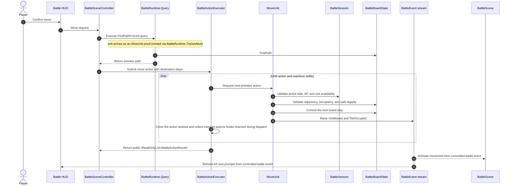

# Battlescape Tactical Runtime Architecture

This document describes the tactical runtime shape in the repo and the nearby extensions it is designed to support. It reflects the current command-based session design and typed read-side query interface.

## Design Goals

- `BattleSession` is the single source of truth for live tactical state.
- `BattleSession` is constructed from battle setup data: a prepared board state and stable faction order.
- `BattleAction` is the authoritative command layer.
- `BattleActionExecutor` validates primitive actions produced by queued `BattleAction` values.
- Read-side battle questions are represented as typed query objects, executed through `BattleRuntime.Query`.
- Controllers, HUD code, and AI should ask battle-state questions through explicit query types instead of accumulating public query methods on `BattleSession`.
- Godot scene nodes own presentation, input, and focused-unit UX. They do not own tactical truth.
- Board coordinates use normal `Godot.Vector3I` semantics:
  - `X` = width
  - `Y` = levels / height
  - `Z` = length / depth
- Future tactical systems such as pathfinding, effects, and AI should integrate through explicit session reads and action execution instead of mutating scene state directly.

## Current Runtime Diagram

```mermaid
flowchart LR
    subgraph Templates["Static Definitions (Godot Resources)"]
        CombatantData["CombatantData"]
        WeaponData["WeaponData / FirearmWeaponData"]
        ItemData["EquippableItemData / ThrowableItemData"]
        FactionData["FactionData"]
        BattleConfig["Battle setup data"]
    end

    subgraph Runtime["Authoritative Tactical Runtime"]
        BattleSession["BattleSession\nsingle source of truth\nturn flow + bookkeeping"]
        BoardState["BattleBoardState\nBattleTileState[x,y,z]\noccupancy + spatial path queries"]
        UnitState["BattleUnitState[]\nAP, health,\ninventory refs,\ncurrent visibility"]
        VisibilityMemory["Explored tile memory\nper faction"]
        EventStream["BattleEvent stream"]
        Actions["BattleAction\nqueued intent + primitive commands"]
        ActionExecutor["BattleActionExecutor\naction queue + invocation"]
        Queries["IBattleSessionQuery&lt;TResult&gt;\ntyped read questions"]
        RuntimeFacade["BattleRuntime\nfacade: Query entry point,\nproof mint doors"]
    end

    subgraph Presentation["Godot Presentation / Input"]
        SceneController["BattleSceneController\ninput translation,\nselection UX, camera"]
        EventSignalHandler["BattleEventSignalHandler\nruntime binding,\nGodot signals"]
        BattleScene["BattleScene / scene nodes\nmap visuals, units, VFX"]
        HUD["Battle HUD\naction buttons, turn controls,\npreviews"]
    end

    Templates --> BattleSession

    BattleSession --- BoardState
    BattleSession --- UnitState
    BattleSession --- VisibilityMemory
    BattleSession --- EventStream
    Actions -->|"refresh visibility on success"| BattleSession
    Queries -->|"read only"| BattleSession
    Queries -->|"read only"| BoardState
    Queries -->|"read only"| UnitState
    Queries -->|"read only"| VisibilityMemory

    HUD -->|"player request"| SceneController
    BattleScene -->|"selection / hover / click"| SceneController
    SceneController -->|"translate to action"| ActionExecutor
    SceneController -->|"ask typed query"| RuntimeFacade

    ActionExecutor -->|"invoke primitive action"| Actions
    Actions -->|"execute against"| BattleSession
    RuntimeFacade -->|"Query(query)"| Queries

    EventStream -->|"BattleEventCommitted"| EventSignalHandler
    EventSignalHandler -->|"Godot signal"| BattleScene
    EventSignalHandler -->|"Godot signal"| HUD
```



## Ownership Rules

- `BattleSession` owns:
  - battle phase
  - turn number
  - active side
  - global faction order
  - pooled unit identity
  - unit position lookup
  - round queue
  - alive and dead unit bookkeeping
  - current-turn unit availability
  - faction explored-tile memory
  - tile visibility refresh
  - authoritative battle event emission
- `BattleBoardState` owns:
  - tile storage
  - walkability and occupancy state
  - adjacency queries
  - occupant placement, movement, and removal
  - board-local pathfinding queries
- `BattleAction` owns action-specific application and any composite action sequencing after executor-side validation succeeds.
- `BattleActionExecutor` owns:
  - preview validation for supported primitive actions
  - the pending action queue
  - invocation order
  - hook-interrupt scheduling from hooks firing during a primitive's action window
  - last-result tracking
  - exception isolation around command execution
- `BattleRuntime` owns:
  - the single public entry point for read-side tactical questions (`Query`)
  - null and disposal guards around query invocation
  - the proof mint doors for scene code: `TryGetAlive(unit) : Option<AliveUnit>` and `TryGetTile(coordinates) : Option<ValidatedPoint>`
- concrete `IBattleSessionQuery<TResult>` implementations own:
  - one specific read-side question
  - the result shape for that question — bare `TResult`, `Option<T>`, or `Either<BattleQueryFailure, TResult>`
  - any query-specific composition across session, board, visibility, or unit state
- `BattleSceneController`, `BattleScene`, and HUD own:
  - focused / selected unit UX
  - previews
  - camera behavior
  - presentation timing
- `BattleEventSignalHandler` owns:
  - binding and unbinding a `BattleRuntime`
  - adapting runtime events into Godot signals
  - wrapping domain events and action results in Godot-compatible signal payloads
- `BattleSession` does not track a selected unit. Selection is presentation state.
- `BattleSession` should not grow a public method for every controller, HUD, or AI question.
- Inventory currently lives on `BattleUnitState`. There is no separate `BattleItemState` runtime layer yet.

## Runtime Components

### BattleSession

`BattleSession` currently exposes authoritative state and bookkeeping around:

- `Board`
- `Phase`
- `TurnNumber`
- `ActiveSide`
- `AliveUnits`
- `DeadUnits`
- `GlobalFactionTurnOrder`
- `TurnQueue`

It is initialized with:

- `BattleBoardState board`
- `IEnumerable<Faction> globalFactionOrder`

The configured faction order must contain at least one faction. The setup turn queue and `ActiveSide` are initialized from the first faction in that order.

The session owns:

- creating runtime unit ids
- moving units between alive and dead storage
- handling faction elimination
- rebuilding and advancing the round queue
- refreshing action-point availability for the active side
- rebuilding faction visibility after successful actions
- ending the battle when no living factions remain

The target public read-side surface is typed query objects through `BattleRuntime.Query`, not a growing method list:

```csharp
var result = runtime.Query(new SomeBattleQuery(...));
```

The session may keep internal helpers for actions and query objects, but controllers and AI should not depend on those helpers directly.

### IBattleSessionQuery

Read-side tactical questions should be modeled as typed query objects.

Current base shape:

```csharp
public interface IBattleSessionQuery<out TResult>
{
  public TResult Execute(BattleSession session);
}
```

Queries are invoked through `BattleRuntime.Query(...)`, which guards against null/disposed misuse and executes the query against its session; `BattleSession` does not expose a public query surface directly.

Each query's result shape declares whether the question can fail:

- **Bare `TResult`** — the default. The question always has an answer: usually because proof-typed inputs (`AliveUnit`, `ValidatedPoint`) carry the needed invariants (`FindPathForUnit`, `GetVisibleEnemiesForUnit`), occasionally because any input has a meaningful answer (`CanUnitActNow` takes a raw `BattleUnitState` — `false` covers dead or off-turn units).
- **`Option<T>`** — absence is a normal answer, not a failure (`GetUnitAtTile`, `GetOperationForFaction`).
- **`Either<BattleQueryFailure, TResult>`** — the question itself can be infeasible at runtime (`GetHitChanceForAttack` when the target is out of range or unseen, `GetFactionEndOfBattleSummary` before the battle ends). Callers handle the `Left` before using the `Right` value.

Missing/dead units and off-board tiles are no longer query failures: they are rejected at the proof mint doors before a query is ever built. Scene code holding a raw `BattleUnitState` or coordinate mints proofs through `BattleRuntime.TryGetAlive(unit) : Option<AliveUnit>` and `TryGetTile(coordinates) : Option<ValidatedPoint>`; the `None` path is what used to surface as a query `Left`. Misusing the trusted core — passing a proof into a context it was never valid for, or asking a question the current phase cannot answer (for example `CanUnitActNow` while the battle is not in progress) — is programmer error and is guarded by exceptions that are not meant to be caught, per the trusted-core convention.

Example query types:

- `FindPathForUnit`
- `GetPossibleMoveTilesForUnit`
- `GetVisibleEnemiesForUnit`
- `GetVisibleUnitsForFaction`
- `CanUnitActNow`
- `IsTileVisibleToFaction`
- `GetFactionAliveUnits`

Each query should encode one question. Avoid catch-all query classes with enum modes, nullable selector fields, or behavior controlled by unrelated properties. If a query algorithm becomes complex or variable, use a strategy behind that specific query rather than turning `BattleRuntime.Query` into a dispatch switch.

### BattleBoardState

`BattleBoardState` now owns board-local spatial operations:

- `TryPlaceOccupant(...)`
- `TryMoveOccupant(...)`
- `TryClearOccupant(...)`
- `FindPath(...)`
- `AreAdjacent(...)`

Pathfinding is currently integrated directly into the board through Godot `AStar3D`. Query objects should be the controller-facing surface for unit-specific path questions, for example `FindPathForUnit` and `GetPossibleMoveTilesForUnit`. If path rules become substantially more unit-specific later, this can be extracted behind a movement-query strategy without changing the controller-facing query contract.

### BattleSession Visibility

`BattleSession` owns visibility refresh because visibility is derived from session-owned unit positions, tile state, and faction explored-tile memory.

Current behavior:

- uses `VisionStat` as the maximum sight range per unit
- flood-fills visible tiles through same-level orthogonal neighbors inside the observer's vision range
- treats whole-tile LOS blockers as visible, then stops visibility expansion past that blocker
- includes same-level adjacent diagonal tiles as visible without using them as flood-fill expansion points
- treats units as visible when they stand on a currently visible tile
- stores each unit's current visible `BattleBoardState.ValidatedPoint`s and visible `BattleUnitState` handles on `BattleUnitState`
- stores explored `BattleBoardState.ValidatedPoint` memory per faction on `BattleSession`
- keeps own living units known to their faction even without direct LOS
- refreshes current unit visibility after committed battle events

Current limitations:

- vision is omnidirectional
- `BlocksLineOfSight` is whole-tile occlusion
- there is no smoke attenuation, lighting model, or last-known enemy memory yet

### BattleAction

The current built-in authoritative actions are:

- `StartBattle`
- `SpawnUnit`
- `MoveUnit`
- `AttackUnit`
- `ReloadWeapon`
- `ThrowItem`
- `ApplyDamage`
- `PassUnit`
- `EndFactionTurn`

Actions should execute through an explicit executor:

```csharp
var executor = new BattleActionExecutor(session);
var result = executor.Submit(BattleAction.MoveUnit(unit, [destination]));
```

Submitted action results are returned as `IReadOnlyList<BattleActionResult>`. The list reports public action outcomes, not every primitive child commit from a composite action. Each produced result includes:

- success or failure
- failure reason
- optional affected unit
- optional message

### BattleActionExecutor

`BattleActionExecutor` accepts submitted `BattleAction` values. Composite actions yield one primitive `BattleAction` at a time, and the executor invokes primitive actions until the submitted action and its reaction actions settle. Each primitive action validates itself against the current `BattleSession` before committing changes.

Current responsibilities:

- `Submit(...)`
- `OnActionStart` event
- `OnActionComplete` event
- `LastResult`

Hook registration is not an executor responsibility: hooks register on the session (public door `BattleRuntime.RegisterHook<TEventKey>(hook, phase, priority)`, plus `UnregisterHook`), and the executor's only involvement is opening an action window around each primitive so hook-returned interrupts have somewhere to land.

The executor does not currently:

- own selection logic
- mutate session state directly outside action execution

### BattleEventSignalHandler

`BattleEventSignalHandler` is the current Godot-side signal boundary over `BattleRuntime`. Scene code binds it to a runtime and listens to Godot signals instead of subscribing directly to pure C# backend events.

Current responsibilities:

- `Bind(BattleRuntime runtime)`
- `Unbind()`
- `PresentationEventCommitted` Godot signal
- `ActionStarted` Godot signal
- `ActionCompleted` Godot signal

The handler wraps committed `BattleEvent` values in a single `BattleEventAdapter` `RefCounted` envelope. That keeps signal payloads Godot-compatible while preserving access to the original committed event for C# presentation code. Scene components that need read data should call `BattleRuntime.Query(...)` directly and handle the query result shape from the backend.

The handler should stay focused on signal adaptation. It should not validate battle legality, mutate `BattleSession`, cache authoritative state, own query helpers, or become the owner of selected-unit UX. Those responsibilities belong to actions, the session, read queries, and scene controllers respectively.

## Representative Flow: Current Move Command



## Turn Flow Notes

- The battle starts from `BattlePhase.Setup` and transitions to `InProgress` through `StartBattle`.
- Setup initializes the turn queue from the stable global faction order.
- `StartBattle` rebuilds the active round queue from living factions in that order.
- `ActiveSide` and `TurnNumber` are owned by the session.
- `EndFactionTurn` is the explicit faction-turn action.
- Turn start is the same shape at both invocation sites: refresh the relevant faction's action-point availability, then raise the turn-start events (`TurnStarted`, plus `ActiveSideChanged` on a side flip or `SessionStarted` on battle start), then refresh `RefreshForNewTurn` for the affected units. Buff evaluation is an ordinary `Before` hook on `TurnStartedBattleEvent` (`TurnStartBuffHook`) and on `UnitAddedBattleEvent` at spawn (`UnitSpawnedBuffHook`), so a buff flip lands before that event's own broadcast and — for turn start — before the AP refresh that runs once the dispatch completes and reads (possibly buffed) `MaxActionPoints`. Mid-dispatch observers of `SessionStarted`/`TurnStarted` see pre-refresh action points; this is deliberate, since the refresh always completes before `Submit`/`StartBattle` returns. See `docs/battle-event-trigger-architecture.md` for the full hook model.
- `PassUnit` ends a unit activation and currently advances the turn automatically if that side has no remaining actable units.
- Unit death updates alive/dead storage, board occupancy, current-turn availability, and faction queue membership through session bookkeeping.

## Current Battle Events

The current event stream is intentionally small and authoritative. Presentation code observes it through `BattleSession.BattleEventCommitted`, which is raised only after the corresponding state change has happened.

- `SessionStarted`
- `SessionEnded`
- `TurnStarted`
- `TurnEnded`
- `ActiveSideChanged`
- `UnitAdded`
- `UnitActivationEnded`
- `UnitMoved`
- `TileOccupied`
- `UnitAttacked` — carries attacker, target, weapon, hit-chance breakdown, roll, and whether the attack hit
- `UnitDamaged` — carries the pre-mitigation damage bundle plus the post-mitigation `ArmorDamage` and `HealthDamage` split
- `UnitArmorRegenerated` — raised at the owning faction's turn end only when armor is actually restored; carries unit, amount regenerated, and current armor
- `UnitKilled`
- `ItemThrown`

Presentation code should react to these events instead of inferring state changes from executor internals.

Hook registration keys on `BattleEventTag` types, not an enum. A `BattleHook` can register against a concrete event such as `TileOccupiedBattleEvent`, or against a shared marker interface such as `IPositionedBattleEvent` or `IUnitBattleEvent`, in which case it fires for every committed event implementing that tag, in whichever `HookPhase` (`Before`/`After`) it was registered for. Concrete event subclasses, such as `UnitMovedBattleEvent` and `TurnStartedBattleEvent`, carry event-specific payloads.

Event dispatch is queue-drained: an event raised mid-dispatch is deferred until after the current event finishes processing (breadth-first, not inline). A throwing hook clears the queue and surfaces the exception. `BattleActionExecutor.Submit` throws if called while the session is dispatching events — no hook, in either phase, may inject a second execution loop; a hook's only write channel outward is the interrupt actions it returns from `OnEvent`, which the executor applies through the normal action path once the current primitive's action window closes.

The session's `BattleHookRegistry` is the one hook registry (see `docs/battle-event-trigger-architecture.md` for the full model): every hook is a `BattleHook` (or `BattleHook<TEvent>`) registered against an event-tag type with a `HookPhase` and an int priority, and may mutate state directly and raise follow-up events. `ArmorRegenSystem` is registered `After` on `TurnEndedBattleEvent`, ticking armor regen and raising `UnitArmorRegeneratedBattleEvent`. Damage to an armored unit flows through the pure `DamageResolver` (scripts/battle/combat/) inside `BattleSession.ApplyDamageTo`: each bundle packet is split into armor damage (1.5x floored on element match) and health damage (always from the un-multiplied amount); `UnitDamagedBattleEvent` carries the `ArmorDamage`/`HealthDamage` split alongside the pre-mitigation bundle.

## Future Extensions

These systems are still part of the intended architecture, but they are not implemented as first-class runtime systems yet:

- `BattleRules`
- `BattleEffectSystem`
- `BattleAIController`
- movement-query strategies
- targeting-query strategies

When they are added, they should follow these rules:

- read battle state through typed query objects instead of duplicating tactical truth
- commit tactical changes through explicit actions and `BattleActionExecutor`
- emit structured battle events instead of mutating scene nodes directly
- keep presentation-only concerns out of the authoritative runtime

Reaction fire and richer combat-effect hooks are still future extensions on top of the current action-based runtime.

## Canonical Vocabulary

Use these names consistently in future tactical work:

- `BattleSession`
- `BattleAction`
- `BattleActionResult`
- `BattleActionExecutor`
- `BattleHook` (`BattleHook<TEvent>`, `HookPhase.Before`/`After`)
- `IBattleSessionQuery<TResult>`
- `BattleRuntime`
- `Either<BattleQueryFailure, TResult>`
- `BattleQueryFailure`
- `BattleEventTag`
- `BattleBoardState`
- `BattleTileState`
- `BattleUnitState`
- `BattleEvent`
- `BattleSceneController`

Detailed design notes:

- [BattleActionExecutor Design](./battle-action-executor.md)
- [BattleSession Command Pattern](./battle-session-command-pattern.md)
- [Battlescape Tile System Design](./battlescape-tile-system.md)
