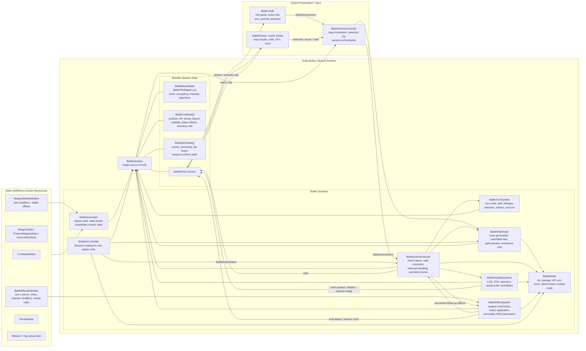
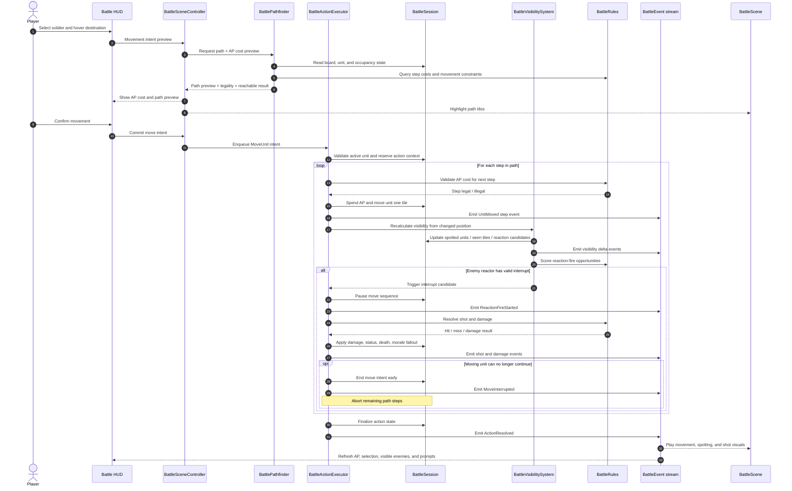

# Battlescape Tactical Runtime Architecture

This document is the target architecture reference for the tactical combat layer. It describes the runtime system boundaries we want to build toward for an X-COM-style battle in Godot, based on the useful separations in OpenXcom without copying its SDL-era implementation shape.

## Design Goals

- `BattleSession` is the single source of truth for live tactical state.
- Resource templates such as `CombatantData`, `WeaponData`, and faction resources feed runtime state but never hold mutable battle progress.
- Tactical systems operate on session state through explicit responsibilities instead of blending rules, rendering, and input together.
- Godot scene nodes present the battle and collect player input, but they do not own combat truth.
- Action resolution is step-based so movement, visibility refresh, and interrupts such as reaction fire can occur mid-action.

## Component Diagram

## Ownership Rules

- `BattleSession` owns all live tactical truth.
- `BattleTurnSystem`, `BattleActionExecutor`, `BattleVisibilitySystem`, `BattleEffectSystem`, and `BattleGenerator` are allowed to mutate `BattleSession`.
- `BattlePathfinder`, `BattleRules`, and `BattleAIController` may read widely, but only the executor, turn system, or explicit effect application path should commit battle-changing results back into session state.
- `BattleSceneController`, `BattleScene`, and HUD nodes translate input, display state, and react to events. They do not spend AP, move units, or mark visibility directly.
- Existing resource types map into the generator phase and runtime instantiation phase only.
- Weapon mods are split between passive stat modifiers and structured battle effects. Effects are resolved through the battle runtime, not by scene nodes or ad hoc script side effects.

## Representative Flow: Move With Visibility Refresh And Reaction Fire

## Canonical Runtime Vocabulary

Use these names consistently in future implementation work, even before all files exist:

- `BattleSession`
- `BattleUnitState`
- `BattleItemState`
- `BattleActionIntent`
- `BattleActionExecutor`
- `BattleTurnSystem`
- `BattleVisibilitySystem`
- `BattlePathfinder`
- `BattleRules`
- `BattleEffectSystem`
- `BattleAIController`
- `BattleEvent`
- `BattleSceneController`

## Battle-Aware Weapon Mods

- Weapon mods should be able to contribute both numeric stat changes and structured battle behavior.
- Keep passive numeric bonuses in the existing stat-mod lane.
- Add a battle-effect lane for behaviors such as burning targets, piercing cover, modifying reaction-fire exposure, changing reload rules, or spawning secondary hazards.
- `BattleEffectSystem` should evaluate these effects at curated hook points such as:
  - before action validation
  - before hit resolution
  - before damage application
  - after damage application
  - on reload
  - on turn start / turn end
- Effects should return structured outcomes for the executor to apply, rather than mutating scene nodes directly.

## Mapping From Current Project Terms

- Your current `CombatantData`, weapon data resources, and `FactionData` remain template definitions.
- The current conceptual `Battle` layer should evolve into `BattleSession`, not exist beside it as a second authoritative runtime owner.
- Current runtime classes such as `Combatant` and `Weapon` are still close to template wrappers; future tactical work should split immutable definitions from mutable battle state explicitly.
